# INSTRUCTIONS-How to Proceed?--->

1)Clone 

2)npm install

3)npm run serve

# Documentation:

### THEME : ERADICATE HUNGER
### TEAM NAME : AGILE
### TEAM MEMBERS : RISHABH SINGHVI AND SHUBHAM JAIN

# IDEA/OBJECTIVE
President Jimmy Carter once said that "We know that a peaceful world cannot exist one-third 
rich and two-thirds hungry.If we want to eliminate hunger,everybody has to be involved.
Though we are in the 21st century, we are still facing global issues like hunger and malnutrition.

The idea of our webapp which ensures that no food is wasted in the social parties,
weddings, homes, hotels and other organization. Basically our web-app deals with the users or the 
volunteers who are left over with the food and want to donate it to the needy. The user can create
his food parcel and can apply for pick up. In a short time the admin will get request and will
initiate the pickup.

We are not done yet!!
To encourage the engagement of the users or the volunteers, they will get points/coins according 
to the quantity of the parcel. These coins can be further redeemed in the form of coupons or other 
products that will be available in the online 'BAZAR'. Here we need sponsers and volunteers who are 
ready to donate and eradicate hunger with their helping hands.

Tech we will be using
We will be making the web app with HTML, CSS, JS, VUEJS and firebase.

# USE-CASE DIAGRAM
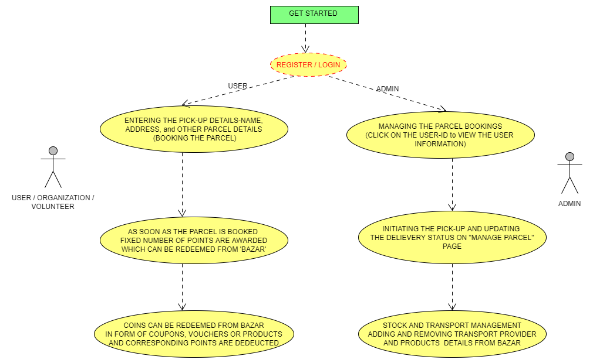

# GET STARTED:

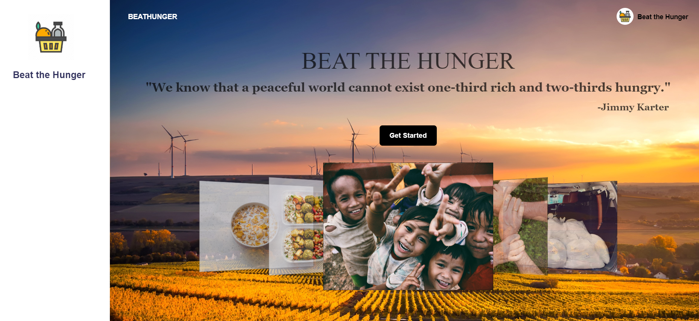
**Let's get started**  
Click on the 'Get Started' Button.  
Register yourself as 'Admin' or 'User'.  
Fill the details like Email Id and password while signing up and proceed.  
Depending upon the field 'USER' or 'ADMIN' you will be directed to different
pages.  

# PROCEDURE
## USER/VOLUNTEER/ORGANIZATION
## Register yourself as user
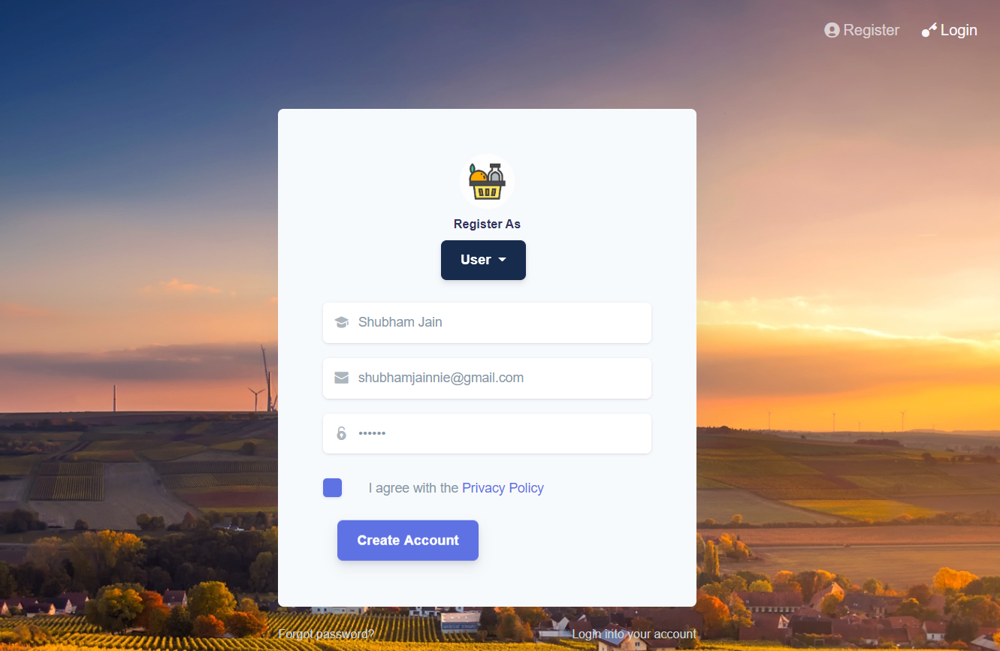
  
## Booking the Food Parcel
The user or the volunteer has to fill all the details regarding the food parcel
packed. 
Now the user clicks 'Pick the parcel' button, a pop-up opens so that all the details
can be verified. 
Now confirm your details shown in the pop-up and submit it.
Once the Parcel is booked, the Admin gets all the information about the parcel
and can initiate the transport for pick-up.
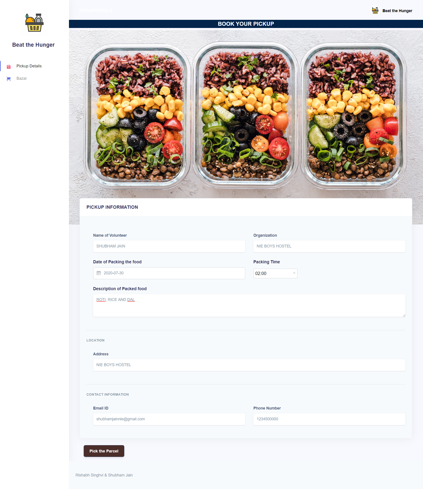
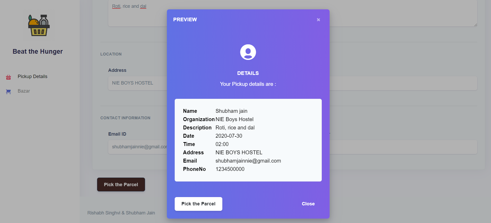
  

## Shop from the 'BAZAR'
The user/volunteer gets some fixed number of coins as the reward for each food
packet sent. 
These coins can be redeemed through the online "Bazar" in form of coupons
or products. 
 
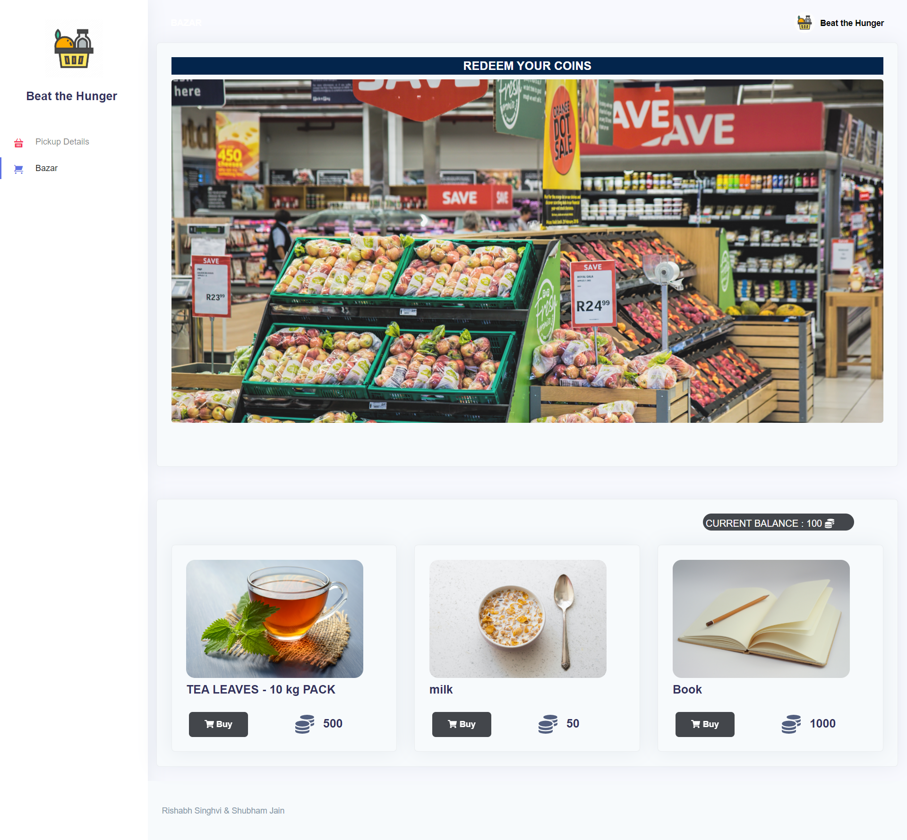
 

# ADMIN
## Register yourself as admin
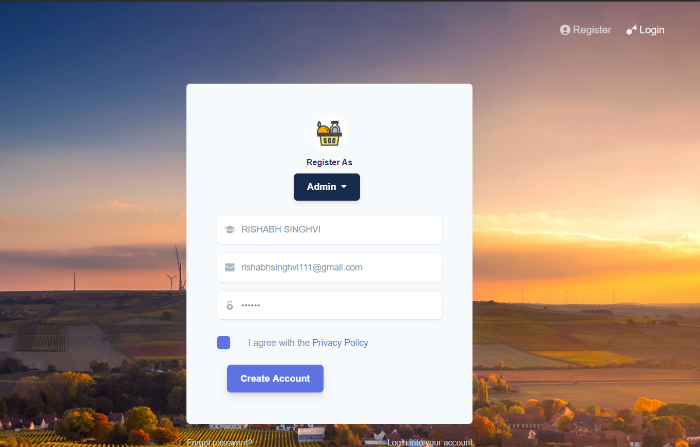
  

## Managing the Parcels
 
The admin has the complete database of the users.
On clicking the User-ID , the admin can view the user profile.
 
For example, 
The red box shows the user-id and the current status which is 
"Pending".Click on "Initiate" button. 
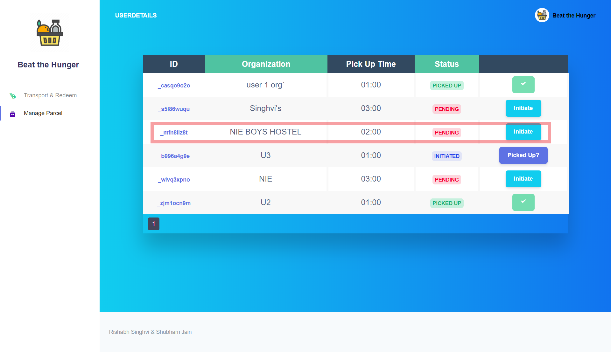
  
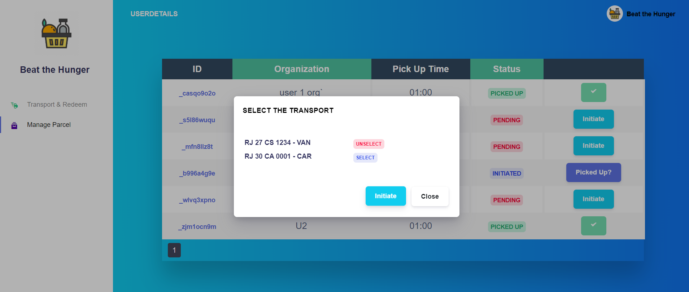
  
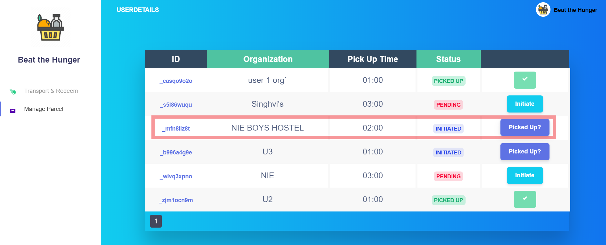
  
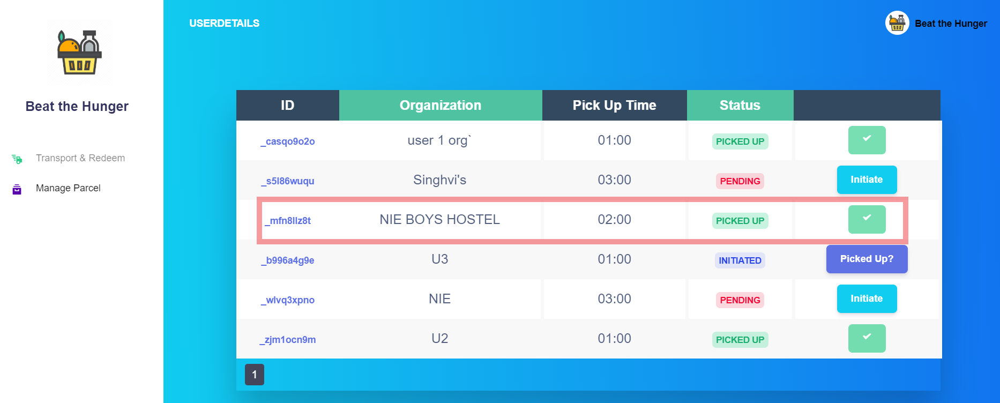
  
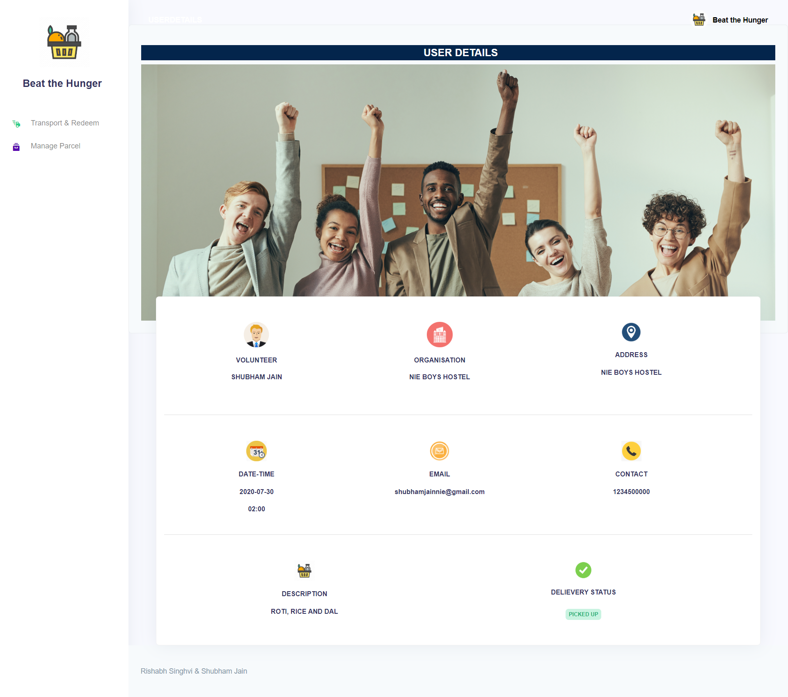

## Adding and Removing Transport Provider and Stock of Products

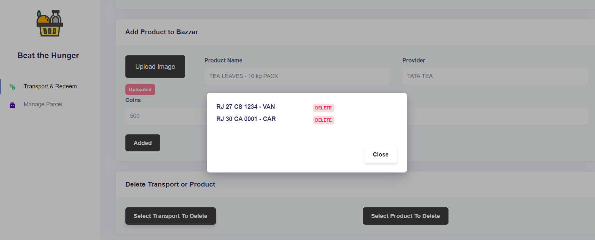
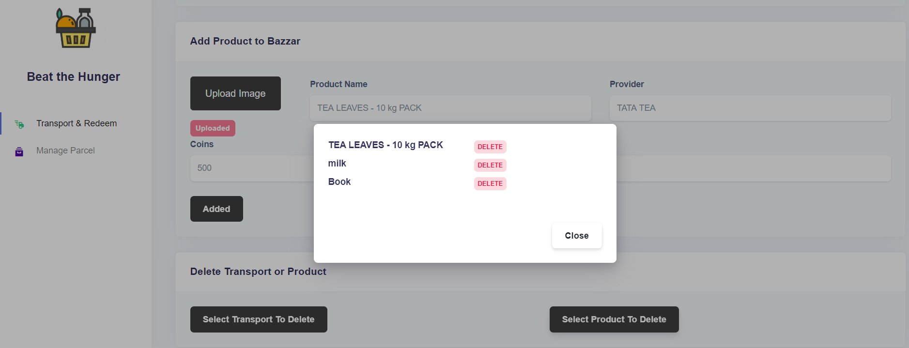
=======

