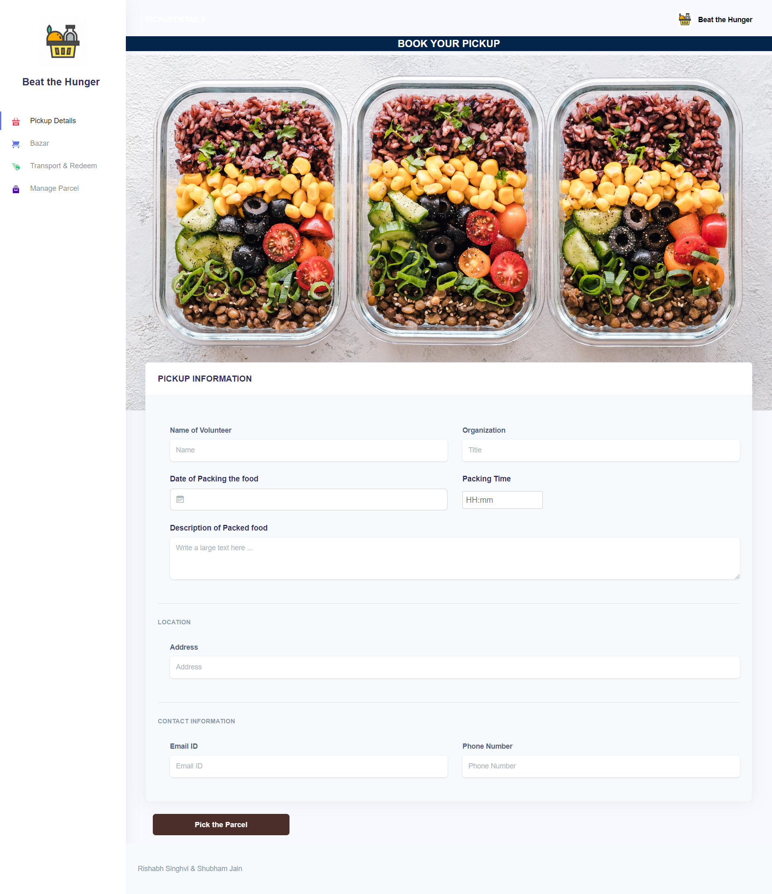
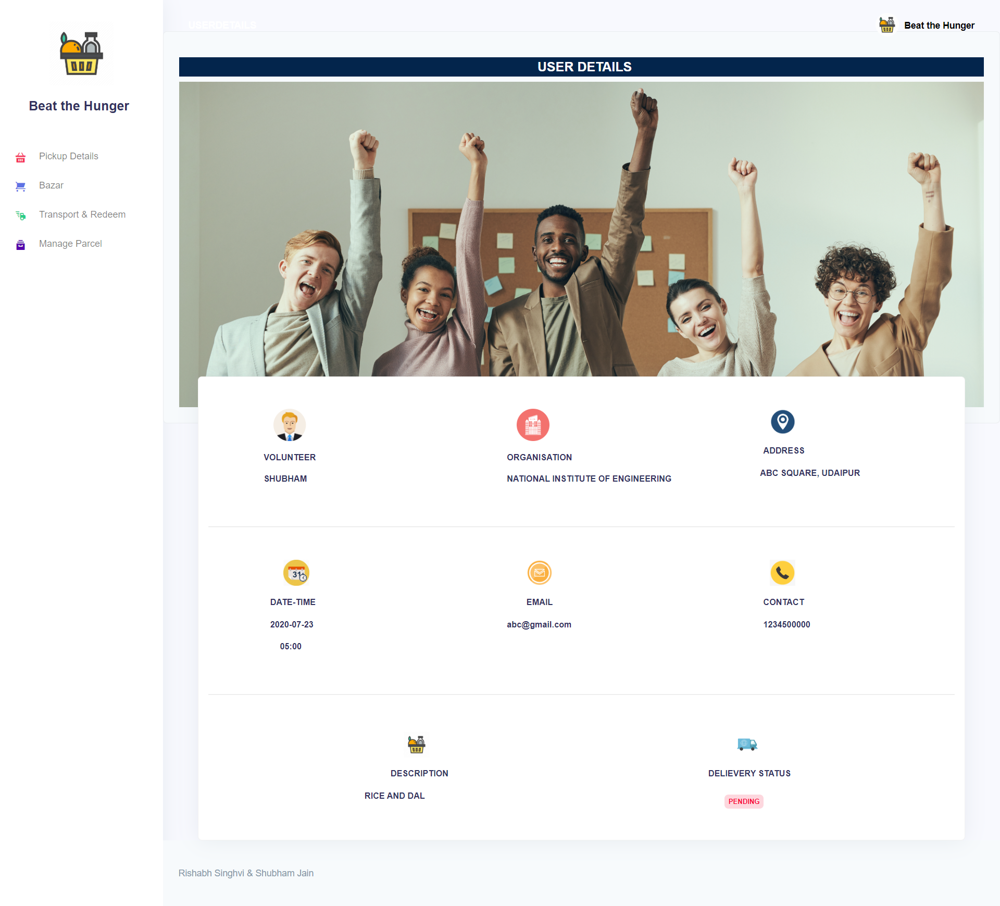

# INSTRUCTIONS-How to Proceed?--->

1)Clone the repo

2)npm install

3)npm run serve

# Documentation:

# OBJECTIVE(IDEA)
## THEME:ERADICATE HUNGER
## TEAM NAME: AGILE
## TEAM MEMBERS:
RISHABH SINGHVI AND SHUBHAM JAIN

## IDEA
The idea of our webapp which ensures that no food is wasted in the social parties,
weddings, homes, hotels and other organization. Basically our web-app deals with the users or the 
volunteers who are left over with the food and want to donate it to the needy. The user can create
his food parcel and can apply for pick up. In a short time the admin will get request and will
initiate the pickup.

We are not done yet!!
To encourage the engagement of the users or the volunteers, they will get points/coins according 
to the quantity of the parcel. These coins can be further redeemed in the form of coupons or other 
products that will be available in the online mart. Here we need sponsers and volunteers who are 
ready to donate and eradicate hunger with their helping hands.

Tech we will be using
We will be making the web app with HTML, CSS, JS, VUEJS and firebase.

# GET STARTED:

Let's get started 
Click on the 'Get Started' Button.
Register yourself as 'Admin' or 'User'.
Fill the details like Email Id and password while signing up and proceed.

# USER/VOLUNTEER
## Placing the Booking for the Food Parcel
The user or the volunteer has to fill all the details regarding the parcel.
Once user clicks 'Pick the parcel' button, a pop-up opens so that all the details
can be verified.
Since the Parcel is booked, the Admin gets all the information about the parcel
and can initiate the transport for pick-up.

## Shop from the Bazar
The user gets some fixed number of coins for each food packet sent as the reward.
These coins can be redeemed through the "Bazar"

# ADMIN
## Transport and Redeem Management
The admin can manage all the transport and product details through this page i.e.
All the transport which are currently available for pickup and the stock of the 
products in bazar.

## User Profiles
Through this page,the admin managing the website can view the user profile and can
check whether the order is picked up, delievered or not.

=======

